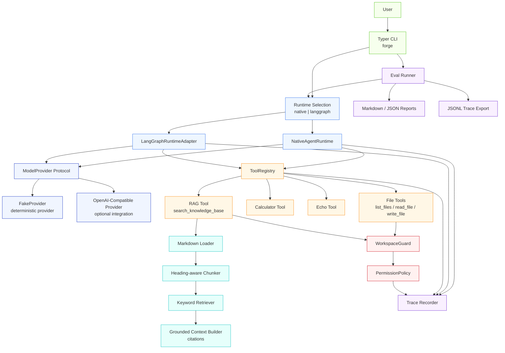
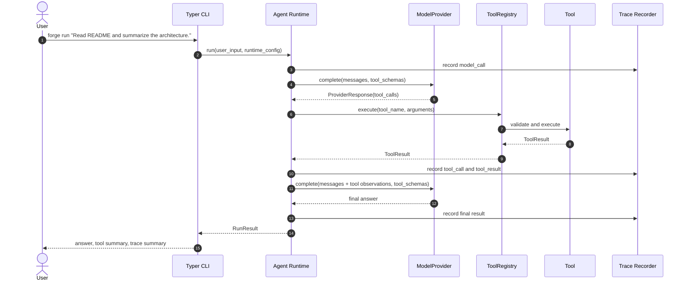
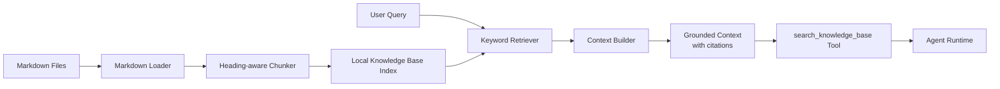

# forge-agent

A minimal Agent Platform demo designed to demonstrate the core engineering capabilities behind production-grade AI agents.

`forge-agent` includes a native Agent Runtime, model provider abstraction, tool registry, RAG tool, workspace permission guard, trace events, evaluation runner, and a LangGraph runtime adapter. The project focuses on platform-level abstractions rather than a single LangChain demo, and uses tests and eval cases to make key behaviors reproducible and verifiable.

This repository is intentionally scoped as a learning and portfolio project. It is not a production SaaS platform, not a full-featured agent framework, and not a replacement for mature frameworks such as LangChain, LangGraph, OpenAI Agents SDK, or other production agent platforms.

---

## Project Overview

`forge-agent` demonstrates how an Agent Platform can be decomposed into clear, testable engineering boundaries:

* Runtime orchestration
* Model provider abstraction
* Tool schema and execution
* Local RAG pipeline
* Workspace permission guard
* Structured trace events
* Deterministic evaluation runner
* Optional LangGraph workflow adapter
* CLI-based demo surface

The project is intentionally compact. The goal is not to maximize features, but to show that core platform behaviors can be run, tested, evaluated, traced, and explained.

---

## Core Capabilities

| Capability                  |     Status | Description                                                                                               |
| --------------------------- | ---------: | --------------------------------------------------------------------------------------------------------- |
| Native Agent Runtime        |       Done | Multi-step agent loop with tool calls, observations, stop reasons, and max-step protection.               |
| Model Provider Abstraction  |       Done | Runtime depends on a provider interface instead of a specific model vendor.                               |
| Deterministic Fake Provider |       Done | Enables stable tests and demos without a network dependency.                                              |
| OpenAI-Compatible Provider  | Demo-ready | Provides an extension point for real model providers without coupling runtime logic to a vendor.          |
| Tool Registry               |       Done | Registers tools, exposes schemas, validates arguments, and returns structured tool results.               |
| File Tools                  |       Done | Supports workspace-scoped file listing and reading.                                                       |
| RAG Tool                    |       Done | Loads local Markdown knowledge base, chunks documents, retrieves relevant context, and returns citations. |
| Workspace Guard             |       Done | Blocks path traversal, absolute path escape, and symlink escape outside the workspace.                    |
| Permission Policy           |       Done | Allows reads by default and denies writes by default unless explicitly enabled.                           |
| Trace Events                |       Done | Records model calls, tool execution, permission decisions, and eval trace output.                         |
| Eval Runner                 |       Done | Runs JSONL eval cases and writes Markdown/JSON reports and JSONL traces.                                  |
| LangGraph Adapter           |       Done | Provides an optional workflow runtime while keeping the native runtime abstraction stable.                |
| CLI                         |       Done | Provides `run`, `rag index`, and `eval` commands.                                                         |
| Tests                       |       Done | Covers runtime, tools, RAG, permission, eval, trace, LangGraph, and CLI paths.                            |

---

## Architecture Diagram



---

## Runtime Flow



The minimal loop is:

```text
model_call -> tool_call -> tool_result -> next model_call -> final_answer
```

The runtime owns orchestration. Providers, tools, permission checks, RAG, and trace export remain independently testable.

---

## RAG Flow



The local RAG pipeline is intentionally simple:

1. Load Markdown documents from a local knowledge base.
2. Split documents into heading-aware chunks.
3. Preserve source metadata and heading paths.
4. Retrieve relevant chunks using deterministic keyword matching.
5. Build grounded context with citations.
6. Expose the search capability as an agent tool.

This keeps the demo deterministic and easy to test. In a production system, the retriever could be replaced by embeddings, a vector database, hybrid retrieval, reranking, or a managed search backend.

---

## Quick Start

### Requirements

* Python 3.13+
* `uv`

### Install dependencies

```bash
uv sync
```

### Show CLI help

```bash
uv run forge --help
```

Expected commands:

```text
run   Run one agent task.
eval  Run deterministic agent evals from a JSONL dataset.
rag   RAG commands.
```

---

## Demo 1: Tool Calling

Run a basic tool-calling task:

```bash
uv run forge run "Read README and summarize the architecture."
```

The runtime will:

1. Send the user input to the configured model provider.
2. Receive one or more tool calls.
3. Execute tools through the registry.
4. Feed tool observations back to the provider.
5. Return a final answer with structured runtime metadata.

You can also explicitly select the runtime:

```bash
uv run forge run "Read README and summarize the architecture." --runtime native
```

```bash
uv run forge run "Read README and summarize the architecture." --runtime langgraph
```

---

## Demo 2: RAG with Citation

Index the local knowledge base:

```bash
uv run forge rag index examples/knowledge_base
```

Ask a question grounded in the knowledge base:

```bash
uv run forge run "According to the knowledge base, how does the permission system work?"
```

The RAG path demonstrates:

* local Markdown loading
* heading-aware chunking
* deterministic retrieval
* grounded context building
* source citation output
* runtime integration through a tool

---

## Demo 3: Eval and Trace

Run the deterministic eval dataset:

```bash
uv run forge eval examples/evals/agent_platform.jsonl
```

The eval runner checks whether each case satisfies expected behavior such as:

* expected tool usage
* expected answer content
* expected source citations
* expected stop reason
* case-level success or failure

Depending on CLI options and defaults, eval execution can produce:

* Markdown report
* JSON report
* JSONL trace file

The trace file is useful for understanding model calls, tool execution, permission decisions, and failure modes.

---

## Final Verification

The expected local quality gate is:

```bash
uv run pytest -v
uv run mypy src tests
uv run ruff check .
uv run ruff format --check .
uv run forge --help
uv run forge run "Read README and summarize the architecture."
uv run forge rag index examples/knowledge_base
uv run forge run "According to the knowledge base, how does the permission system work?"
uv run forge eval examples/evals/agent_platform.jsonl
```

Optional repository checks:

```bash
git status --short
git log --oneline --decorate -n 15
```

Current verified baseline:

```text
pytest: 138 passed
mypy: no issues found
ruff check: all checks passed
ruff format: all files formatted
forge --help: exits successfully
```

---

## Project Structure

```text
forge-agent/
├── examples/
│   ├── evals/
│   │   └── agent_platform.jsonl
│   └── knowledge_base/
│       └── *.md
├── src/
│   └── forge_agent/
│       ├── cli/
│       │   └── app.py
│       ├── evals/
│       │   ├── dataset.py
│       │   ├── metrics.py
│       │   ├── report.py
│       │   └── runner.py
│       ├── integrations/
│       │   └── langgraph/
│       │       └── workflows.py
│       ├── observability/
│       │   ├── events.py
│       │   ├── exporter.py
│       │   └── trace.py
│       ├── providers/
│       │   ├── base.py
│       │   ├── fake.py
│       │   └── openai_compatible.py
│       ├── rag/
│       │   ├── chunker.py
│       │   ├── knowledge_base.py
│       │   ├── loader.py
│       │   └── retriever.py
│       ├── runtime/
│       │   ├── native_runtime.py
│       │   ├── protocol.py
│       │   └── state.py
│       ├── security/
│       │   ├── errors.py
│       │   ├── permission.py
│       │   └── workspace.py
│       └── tools/
│           ├── base.py
│           ├── calculator.py
│           ├── defaults.py
│           ├── echo.py
│           ├── file_tools.py
│           ├── rag_tool.py
│           └── registry.py
├── tests/
│   ├── test_cli_eval.py
│   ├── test_cli_rag.py
│   ├── test_cli_run.py
│   ├── test_eval_*.py
│   ├── test_file_tools_permission.py
│   ├── test_langgraph_trace.py
│   ├── test_permission_*.py
│   ├── test_rag_*.py
│   ├── test_runtime_*.py
│   ├── test_tool_registry.py
│   ├── test_trace_exporter.py
│   └── test_workspace_guard.py
├── docs/
├── pyproject.toml
├── README.md
└── LICENSE
```

---

## Design Decisions

### 1. Native runtime first

The project starts with a self-owned runtime instead of delegating all behavior to a framework.

This makes the core loop explicit:

```text
input -> model call -> tool call -> tool result -> next model call -> final answer
```

Benefits:

* easier to test
* easier to explain in interviews
* clear ownership of stop conditions and error handling
* framework-independent runtime contract

### 2. LangGraph as an adapter

LangGraph is integrated as an optional runtime adapter, not as the only runtime.

This keeps the platform boundary stable:

```text
CLI -> Runtime Protocol -> Native Runtime or LangGraph Adapter
```

Benefits:

* preserves the native runtime as the reference implementation
* allows workflow orchestration to be swapped or extended
* avoids coupling all business logic to LangGraph-specific APIs

### 3. Deterministic provider for tests

`FakeProvider` is used to make runtime behavior deterministic.

Benefits:

* no external API key required
* no network dependency in tests
* stable CI behavior
* repeatable tool-calling and eval scenarios

### 4. RAG as a tool

RAG is exposed as a platform tool instead of being hardcoded into the runtime.

Benefits:

* the runtime stays generic
* RAG can be permission-checked and traced like other tools
* retrieval logic can be tested independently
* future vector retrieval can replace the current keyword retriever

### 5. Permission before file access

Workspace safety is enforced before file tools and RAG index paths access local files.

The guard blocks:

* `../` path traversal
* absolute path escape
* symlink escape outside the workspace

The permission policy denies writes by default.

### 6. Trace and eval as first-class concerns

Trace events and eval reports are part of the platform demo, not afterthoughts.

The project records key events such as:

* model call
* tool call
* tool result
* permission decision
* eval case result

This makes behavior easier to debug, evaluate, and explain.

---

## Testing

The test suite covers the core platform matrix.

### Runtime Tests

* provider returns tool calls
* runtime executes tool calls
* runtime stops when completed
* runtime stops at max steps
* runtime handles tool errors
* native and LangGraph runtimes return the same result shape

### Tool Tests

* registry registers tools
* duplicate tool names are rejected
* unknown tools return structured errors
* argument validation errors are structured
* file tools use workspace guard

### RAG Tests

* Markdown loader loads documents
* chunker preserves source metadata
* retriever returns relevant chunks
* context builder includes citations
* RAG tool returns grounded results

### Permission Tests

* read inside workspace is allowed
* read outside workspace is denied
* write requires permission
* path traversal is blocked
* permission denial is recorded in trace

### Eval and Trace Tests

* eval runner loads JSONL
* expected tool usage is checked
* expected answer content is checked
* trace records model and tool events
* trace exporter writes JSONL

### CLI Tests

* CLI help works
* run command works
* RAG index command works
* eval command works
* runtime selection works

Run all checks:

```bash
uv run pytest -v
uv run mypy src tests
uv run ruff check .
uv run ruff format --check .
```

---

## Documentation

Additional design notes are available under `docs/`, including:

* runtime architecture
* RAG design
* security model
* evaluation and trace design
* demo scope and limitations
* retrieval quality assessment

These documents are intentionally lightweight and are meant to explain the engineering decisions behind the demo.

---

## Limitations

`forge-agent` is a demo-level Agent Platform, not a production SaaS system.

Current limitations:

* no production-grade sandbox
* no distributed execution
* no persistent multi-turn session store
* no multi-tenant isolation
* no production secret management
* no distributed tracing backend
* no OpenTelemetry integration
* no vector database
* no embedding-based retrieval
* no reranking
* no online evaluation service
* no human approval workflow
* no web UI
* no deployment manifests
* no production CI/CD pipeline included in the demo scope
* no cost tracking or budget enforcement
* no multi-agent orchestration

These are intentionally left out to keep the project focused on core platform abstractions.

---

## Roadmap

Potential future improvements:

### Runtime

* persistent sessions
* streaming output
* interrupt and resume
* richer stop reasons
* human-in-the-loop approval points

### Tooling and Security

* stronger sandbox isolation
* audited write approval flow
* command execution with allowlist policy
* secret redaction
* policy-driven tool permissions

### RAG

* embedding model integration
* vector database backend
* hybrid retrieval
* reranking
* citation quality scoring
* document freshness metadata

### Observability

* OpenTelemetry integration
* trace viewer
* structured logs
* latency metrics
* token and cost metrics

### Evaluation

* larger eval datasets
* regression eval suite
* online eval dashboard
* failure clustering
* quality gates for CI

### Packaging and Deployment

* GitHub Actions CI
* Docker image
* release artifacts
* example deployment profile

---

## Interview Talking Points

### 30-second version

I built `forge-agent`, a minimal Agent Platform demo. The focus is not a single agent application, but the platform capabilities behind agents: runtime orchestration, tool calling, RAG, permission control, trace events, eval runner, and a LangGraph adapter. It has CLI demos, tests, and eval cases to prove the key paths are reproducible and verifiable.

### 2-minute version

`forge-agent` is a minimal Agent Platform demo. At the bottom, I implemented a native Agent Runtime to demonstrate multi-step agent loops, tool calls, stop conditions, and error feedback. The model layer is abstracted through a `ModelProvider` protocol, so the runtime is not coupled to one vendor. The tool layer uses a `ToolRegistry` and structured schemas. RAG is implemented as a platform tool with local Markdown loading, heading-aware chunking, retrieval, and citations. For safety, it has a workspace guard and permission policy to block path traversal and unauthorized writes. For quality and observability, it includes trace events, JSONL trace export, and a deterministic eval runner. Finally, it integrates LangGraph as an optional runtime adapter, showing how workflow orchestration can be added without replacing the platform boundary.

### Production-level gap

This is a demo-level platform rather than a production SaaS system. A production version would need multi-tenant isolation, persistent sessions, distributed tracing, stronger sandboxing, secret management, audit logs, cost controls, vector retrieval, reranking, approval workflows, online evaluation, and CI/CD. The value of this demo is that the core abstractions and critical paths are implemented, tested, and explainable.

---

## License

This project is licensed under the Apache License 2.0. See [LICENSE](LICENSE) for details.
