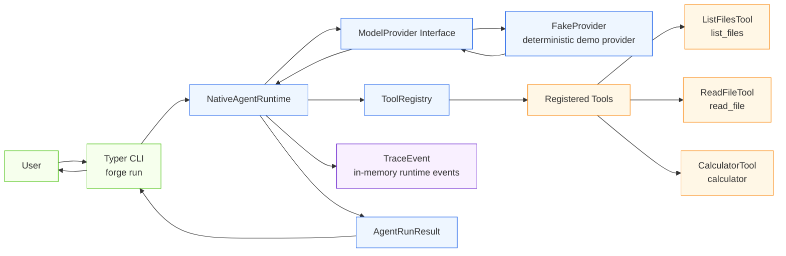
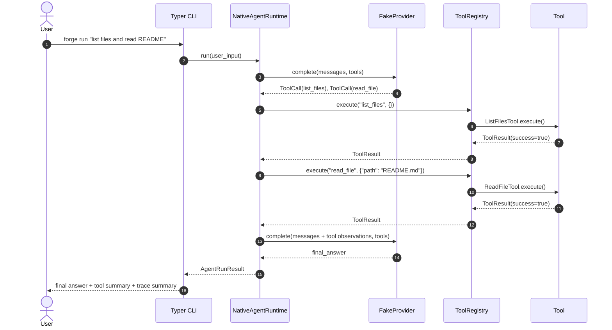
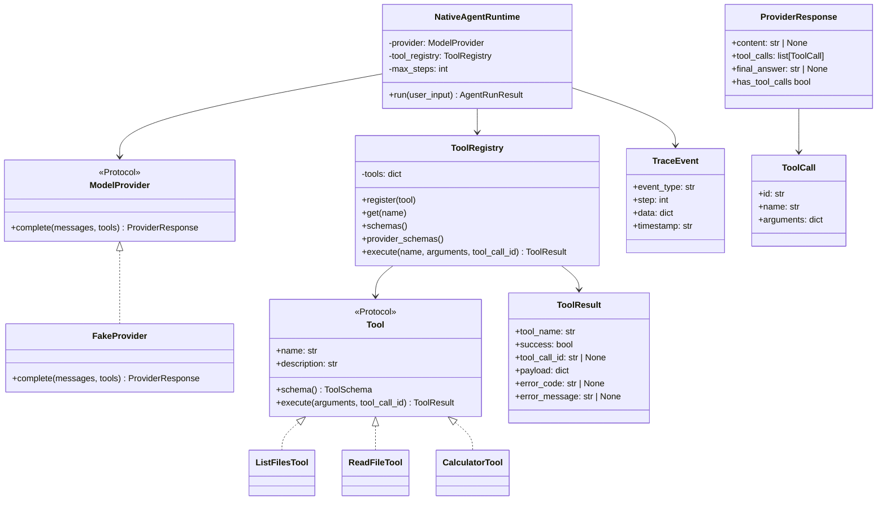
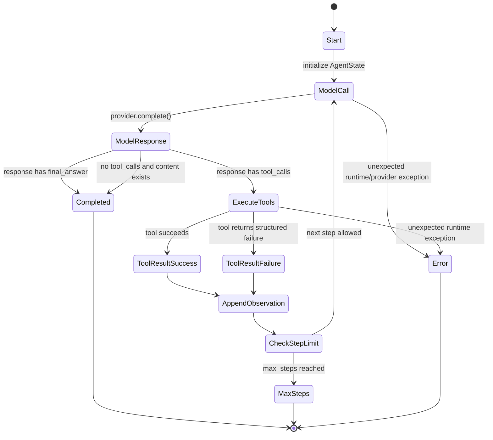
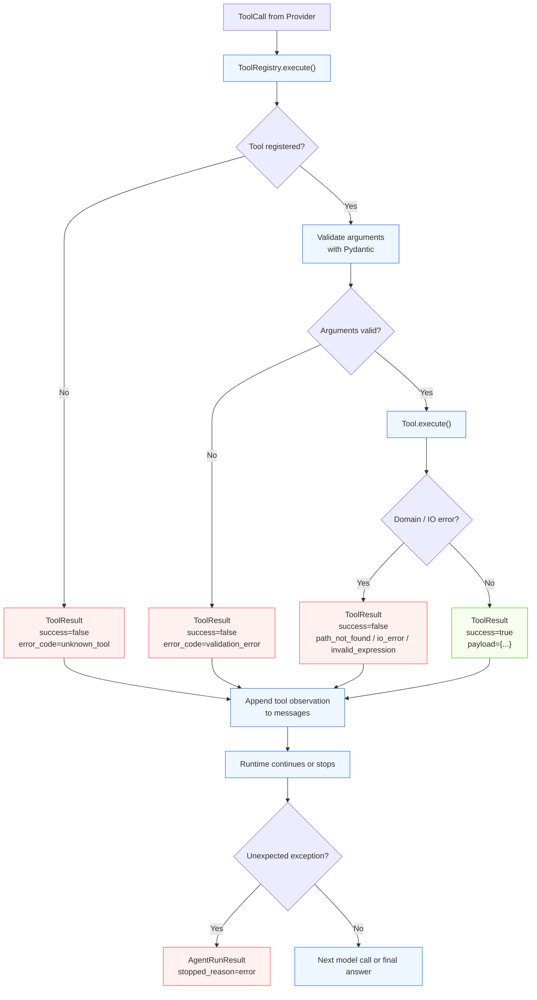
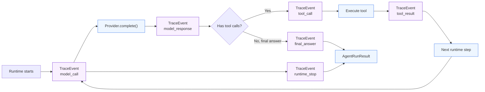
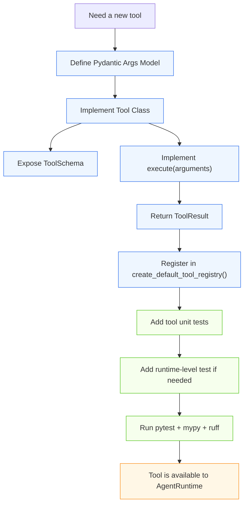
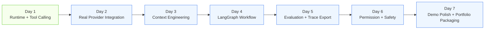

# forge-agent

A minimal, testable Agent Platform runtime built from scratch.

`forge-agent` is a small but architecture-focused implementation of the core runtime behind a tool-calling AI agent. It demonstrates how to separate model providers, runtime orchestration, tool execution, structured tool results, trace events, and CLI presentation into clear and testable components.

This project is intentionally scoped as a learning and portfolio project. It is not a production SaaS platform, not a full-featured agent framework, and not a replacement for mature frameworks such as LangChain, LangGraph, OpenAI Agents SDK, or other production agent platforms.

The goal is to expose the essential engineering decisions behind an Agent Platform in a compact codebase.

---

## Current Status

Current milestone: **Day 1 — Agent Runtime + Tool Calling Skeleton**

Implemented:

* Native Agent Runtime loop
* Model provider abstraction
* Deterministic `FakeProvider`
* Tool abstraction
* Tool registry
* Structured tool results
* Basic in-memory trace events
* CLI command: `forge run`
* Built-in Day 1 tools:

  * `list_files`
  * `read_file`
  * `calculator`
* Quality checks:

  * pytest
  * mypy strict mode
  * Ruff

Not implemented yet:

* Real LLM provider integration
* RAG
* Long-term memory
* Permission sandbox
* LangGraph workflow
* Evaluation framework
* Trace export
* OpenTelemetry integration
* Deployment
* Web UI
* Multi-agent orchestration

---

## Why This Project Exists

Most AI agent examples start by calling an LLM directly and then adding tools around it. This project takes the opposite approach.

It starts from the platform layer:

* What is the runtime contract?
* How should model providers be isolated?
* How should tools be registered and executed?
* How should tool failures be represented?
* How should the runtime avoid infinite loops?
* How should the system remain testable without a real LLM?
* Where should trace events be produced?

The result is a minimal Agent Platform skeleton that can be extended step by step without mixing provider-specific logic, tool implementation details, and runtime control flow.

---

## Design Goals

`forge-agent` follows several engineering principles:

1. **Runtime-first design**

   The core abstraction is the Agent Runtime, not a specific model vendor or framework.

2. **Provider independence**

   The runtime depends on a `ModelProvider` interface, not on OpenAI, Anthropic, DeepSeek, or any specific model API.

3. **Tool isolation**

   Tools are platform capabilities with schema, validation, and structured results. They are not scattered function calls inside the runtime.

4. **Structured failure handling**

   Tool execution errors are converted into `ToolResult(success=False)` instead of leaking exceptions directly to the CLI.

5. **Deterministic testing**

   `FakeProvider` makes the full tool-calling loop testable without a real LLM or network dependency.

6. **Explicit runtime boundaries**

   CLI, Provider, Runtime, Tool Registry, Tools, and Trace are separate concerns.

7. **Small before complex**

   The project intentionally starts with a native runtime before introducing larger frameworks or external services.

---

## High-Level Architecture



### Architecture Notes

* The CLI is only an entrypoint and presentation layer.
* `NativeAgentRuntime` owns the model/tool loop.
* `ModelProvider` hides vendor-specific model behavior from the runtime.
* `ToolRegistry` is the execution boundary for tools.
* Tools validate their own arguments and return structured results.
* Trace events are produced inside the runtime and currently stored in memory.

---

## Core Runtime Flow



### Runtime Flow Notes

The minimal loop is:

```text
model_call -> tool_call -> tool_result -> next model_call -> final_answer
```

The full internal chain is:

```text
UserInput
  -> AgentRuntime
  -> ModelProvider
  -> ToolCall
  -> ToolRegistry
  -> Tool.execute()
  -> ToolResult
  -> AgentRuntime
  -> ModelProvider
  -> FinalAnswer
```

This design makes the runtime responsible for orchestration, while tools and providers remain independently testable.

---

## Core Abstractions



### Abstraction Notes

The most important design decision is dependency inversion:

* Runtime depends on `ModelProvider`, not a real model SDK.
* Runtime depends on `ToolRegistry`, not concrete tools.
* Tools return `ToolResult`, not arbitrary Python objects.
* Provider responses are normalized into internal objects before the runtime consumes them.

This keeps the project extensible and testable.

---

## Runtime State Machine



### Stop Reasons

`NativeAgentRuntime` returns one of three stop reasons:

| Stop Reason | Meaning                                                             |
| ----------- | ------------------------------------------------------------------- |
| `completed` | The provider returned a final answer or a terminal content response |
| `max_steps` | The runtime reached the configured step limit                       |
| `error`     | An unexpected runtime or provider exception occurred                |

The `max_steps` limit is important because tool-calling agents can otherwise loop indefinitely.

---

## Error Handling Model



### Error Handling Notes

The project distinguishes between two categories of failure:

1. **Expected tool-level failures**

   Examples:

   * Unknown tool
   * Invalid arguments
   * Path not found
   * Not a file
   * Not a directory
   * Invalid arithmetic expression
   * IO error

   These are converted into `ToolResult(success=False)` and fed back into the runtime as tool observations.

2. **Unexpected runtime-level failures**

   Examples:

   * Provider implementation raises an unexpected exception
   * Runtime state handling fails
   * Unhandled internal exception

   These become `AgentRunResult(stopped_reason="error")`.

This keeps the CLI stable and avoids leaking tool implementation exceptions directly to the user.

---

## Trace Event Flow



### Trace Notes

Current trace events are stored in memory and returned as part of `AgentRunResult`.

Current event types:

* `model_call`
* `model_response`
* `tool_call`
* `tool_result`
* `final_answer`
* `runtime_stop`

This intentionally avoids binding the runtime to a specific observability vendor. Future versions can export the same events to JSONL, OpenTelemetry, LangSmith, or other tracing backends.

---

## Tool Extension Flow



### Tool Extension Notes

Adding a new tool should not require changing `NativeAgentRuntime`.

The extension path is:

1. Define argument schema.
2. Implement tool schema.
3. Implement tool execution.
4. Return structured `ToolResult`.
5. Register the tool.
6. Add unit tests.
7. Add runtime-level tests when the tool participates in an agent loop.

This makes tools platform capabilities rather than hard-coded branches in the runtime.

---

## Project Structure

```text
src/forge_agent/
  cli/
    app.py

  providers/
    base.py
    fake.py

  runtime/
    events.py
    state.py
    native_runtime.py

  tools/
    base.py
    registry.py
    defaults.py
    file_tools.py
    calculator.py

tests/
  test_cli_run.py
  test_provider_fake.py
  test_runtime_native.py
  test_tool_registry.py
```

### Module Responsibilities

| Module      | Responsibility                                                   |
| ----------- | ---------------------------------------------------------------- |
| `cli`       | User-facing command entrypoint                                   |
| `providers` | Model provider abstraction and deterministic fake provider       |
| `runtime`   | Agent state, runtime loop, stop reasons, trace events            |
| `tools`     | Tool interface, registry, built-in tools                         |
| `tests`     | Unit and integration tests for provider, tools, runtime, and CLI |

---

## Installation

This project uses `uv` for dependency and environment management.

Clone the repository:

```bash
git clone <your-repo-url>
cd forge-agent
```

Install dependencies:

```bash
uv sync
```

---

## Usage

Show CLI help:

```bash
uv run forge --help
```

Run the minimal tool-calling demo:

```bash
uv run forge run "list files and read README"
```

Example output:

```text
Final answer: I inspected the workspace using these tools: list_files, read_file. The README was requested successfully.
Stopped reason: completed
Steps: 2

Tool calls:
- list_files: SUCCESS
- read_file: SUCCESS

Trace events:
- model_call
- model_response
- tool_call
- tool_result
- tool_call
- tool_result
- model_call
- model_response
- final_answer
```

---

## Core Concepts

### ModelProvider

`ModelProvider` defines the interface between the runtime and the model layer.

The runtime does not depend on any specific model vendor. A provider receives normalized messages and tool schemas, then returns a normalized `ProviderResponse`.

Current provider:

* `FakeProvider`: deterministic provider for tests and demos

Planned provider types:

* OpenAI-compatible provider
* Anthropic provider
* Local model provider

### ProviderResponse

`ProviderResponse` is the normalized response consumed by the runtime.

It may contain:

* `content`
* `tool_calls`
* `final_answer`

This keeps vendor-specific response formats out of the runtime.

### Tool

A tool is a platform capability callable by the Agent Runtime.

Each tool provides:

* name
* description
* JSON schema
* argument validation
* structured result

Current tools:

* `list_files`: list files under a directory
* `read_file`: read a UTF-8 text file
* `calculator`: evaluate a safe arithmetic expression

### ToolRegistry

`ToolRegistry` manages tool discovery and execution.

It is responsible for:

* registering tools
* rejecting duplicate tool names
* returning provider-facing schemas
* executing tools by name
* converting unknown tool calls into structured errors

### NativeAgentRuntime

`NativeAgentRuntime` drives the model/tool loop.

It is responsible for:

* initializing agent state
* calling the provider
* executing requested tools
* feeding tool observations back into messages
* enforcing `max_steps`
* producing `AgentRunResult`
* recording trace events

### TraceEvent

`TraceEvent` records important runtime events.

It is intentionally simple and local in Day 1. The point is to define the internal event contract first before connecting external observability systems.

---

## Adding a New Tool

To add a new tool:

1. Create a new file under `src/forge_agent/tools/`.
2. Define a Pydantic argument model.
3. Implement `schema()`.
4. Implement `execute()`.
5. Return a structured `ToolResult`.
6. Register the tool in `create_default_tool_registry()`.
7. Add unit tests for success and validation failure.
8. Add runtime-level tests if the tool is part of an agent loop.

Example structure:

```python
from __future__ import annotations

from typing import Any

from pydantic import BaseModel, ValidationError

from forge_agent.tools.base import ToolResult, ToolSchema


class ExampleArgs(BaseModel):
    text: str


class ExampleTool:
    name = "example_tool"
    description = "Example tool description."

    def schema(self) -> ToolSchema:
        return ToolSchema(
            name=self.name,
            description=self.description,
            parameters=ExampleArgs.model_json_schema(),
        )

    def execute(
        self,
        arguments: dict[str, Any],
        tool_call_id: str | None = None,
    ) -> ToolResult:
        try:
            args = ExampleArgs.model_validate(arguments)

            return ToolResult(
                tool_name=self.name,
                tool_call_id=tool_call_id,
                success=True,
                payload={"text": args.text},
            )
        except ValidationError as error:
            return ToolResult(
                tool_name=self.name,
                tool_call_id=tool_call_id,
                success=False,
                error_code="validation_error",
                error_message=str(error),
            )
```

---

## Testing Strategy

```mermaid
flowchart TD
    Tests["Test Suite"] --> ProviderTests["Provider Tests"]
    Tests --> ToolTests["Tool Tests"]
    Tests --> RuntimeTests["Runtime Tests"]
    Tests --> CLITests["CLI Tests"]

    ProviderTests --> FakeToolCall["FakeProvider returns tool calls"]
    ProviderTests --> FakeFinal["FakeProvider returns final answer"]

    ToolTests --> Registry["ToolRegistry registration"]
    ToolTests --> Duplicate["Duplicate tool rejection"]
    ToolTests --> Unknown["Unknown tool handling"]
    ToolTests --> Validation["Argument validation"]
    ToolTests --> BuiltIns["Built-in tool behavior"]

    RuntimeTests --> Execute["Executes tool calls"]
    RuntimeTests --> Completed["Stops when completed"]
    RuntimeTests --> MaxSteps["Stops at max_steps"]
    RuntimeTests --> ToolError["Handles tool errors"]
    RuntimeTests --> Trace["Records trace events"]

    CLITests --> Demo["forge run executes demo"]

    classDef category fill:#eef6ff,stroke:#2f6feb,stroke-width:1px;
    classDef case fill:#f6ffed,stroke:#52c41a,stroke-width:1px;

    class ProviderTests,ToolTests,RuntimeTests,CLITests category;
    class FakeToolCall,FakeFinal,Registry,Duplicate,Unknown,Validation,BuiltIns,Execute,Completed,MaxSteps,ToolError,Trace,Demo case;
```



### Test Commands

Run tests:

```bash
uv run pytest -q
```

Run type checks:

```bash
uv run mypy src tests
```

Run lint checks:

```bash
uv run ruff check .
```

Run all quality checks:

```bash
uv run pytest -q
uv run mypy src tests
uv run ruff check .
```

---

## Quality Bar

The project is expected to maintain:

* deterministic tests
* no real LLM dependency in Day 1 tests
* strict typing with mypy
* Ruff-clean code
* structured runtime results
* explicit stop reasons
* no tool-specific branches inside the runtime
* no provider-specific response formats leaking into tools
* no uncontrolled agent loop without `max_steps`

---

## Architecture Decisions

### ADR-001: Use a native runtime before framework integration

The project starts with a hand-written `NativeAgentRuntime` to make the control flow explicit.

Reason:

* Easier to understand Agent Loop mechanics
* Easier to test with `FakeProvider`
* Easier to reason about stop conditions
* Avoids hiding core runtime behavior behind a framework too early

Future frameworks such as LangGraph can be introduced after the native runtime contract is stable.

### ADR-002: Use `FakeProvider` as a first-class provider

`FakeProvider` is not just a mock. It is a deterministic provider implementation used for demo and regression testing.

Reason:

* No API key required
* No network dependency
* Repeatable test behavior
* Stable tool-calling flow
* Faster local feedback loop

### ADR-003: Use `ToolRegistry` instead of runtime-level tool branches

The runtime does not use code like:

```python
if tool_name == "list_files":
    ...
```

Instead, it delegates tool lookup and execution to `ToolRegistry`.

Reason:

* Tools are independently extensible
* Runtime stays generic
* Unknown tools can be handled consistently
* Duplicate tool names can be rejected at registration time

### ADR-004: Convert tool failures into `ToolResult`

Expected tool failures are returned as structured results.

Reason:

* Keeps CLI stable
* Allows the model to observe tool failures
* Makes failures testable
* Avoids mixing tool implementation exceptions with runtime-level failures

### ADR-005: Define trace events before integrating observability vendors

Day 1 records trace events in memory.

Reason:

* Establishes internal observability contract first
* Avoids early vendor coupling
* Enables future export to JSONL, OpenTelemetry, LangSmith, or other systems

---

## Roadmap



Planned stages:

| Stage | Focus                                      |
| ----- | ------------------------------------------ |
| Day 1 | Agent Runtime + Tool Calling skeleton      |
| Day 2 | Real model provider integration            |
| Day 3 | Context engineering and message management |
| Day 4 | LangGraph workflow integration             |
| Day 5 | Evaluation and trace export                |
| Day 6 | Permission and safety controls             |
| Day 7 | Final demo polish and portfolio packaging  |

---

## Requirements

* Python 3.13+
* uv
* Typer
* Pydantic
* pytest
* mypy
* Ruff

---

## License

This project is licensed under the Apache License 2.0. See [LICENSE](./LICENSE) for details.

## Demo 1: Tool Calling

This demo shows the native agent runtime executing file tools through the tool registry.

Command:

    uv run forge run "Read the project README and summarize the architecture."

Expected output summary:

    runtime: native
    tools_used: list_files, read_file
    stopped_reason: completed
    final_answer: <architecture summary based on README.md>

What this demonstrates:

- The CLI can dispatch a natural-language task to the agent runtime.
- The runtime can execute tools through the tool registry.
- File tools can read project files inside the configured workspace.
- The final answer is produced from tool-observed project context.

## Demo 2: RAG + Citation

This demo shows the agent using a local Markdown knowledge base to answer a grounded question with source information.

Commands:

    uv run forge rag index examples/knowledge_base
    uv run forge run "According to the knowledge base, how does the permission system work?"

Expected output summary:

    runtime: native
    tools_used: search_knowledge_base
    stopped_reason: completed
    final_answer: <answer grounded in examples/knowledge_base/security.md>
    Citations:
    - [source: security.md#Security > Permission System ...]

What this demonstrates:

- Markdown documents can be indexed as a local knowledge base.
- The agent can call the knowledge-base search tool.
- The final answer is grounded in retrieved context.
- The answer includes source information so reviewers can verify it.
- Retrieval and tool execution are visible through trace events.

## Demo 3: Eval + Trace

This demo shows the quality loop for the agent platform.

Command:

    uv run forge eval examples/evals/agent_platform.jsonl

Expected output summary:

    case_count: 3
    success_rate: 100.00%
    tool_call_success_rate: 100.00%
    expected_contains_pass_rate: 100.00%
    failed_cases: 0
    trace_file: reports/traces.jsonl
    report_file: reports/eval-report.md

What this demonstrates:

- Agent behavior can be validated with JSONL eval cases.
- Tool routing can be checked through expected tool calls.
- Final answers can be checked with expected substrings.
- Trace files make model calls, tool calls, permission checks, and final answers inspectable.
- Eval reports provide a lightweight regression signal for future changes.

## Project Overview

`forge-agent` is a demo-level Agent Platform built as a local CLI application.

It demonstrates the platform capabilities behind modern coding and knowledge agents:

- Agent Runtime
- Model Provider abstraction
- Tool Registry
- Local RAG with citations
- Workspace permission checks
- Trace events
- JSONL evaluation

The project is intentionally small enough to read, test, and explain in an interview, while still showing the architecture shape of a real agent platform.

## Architecture

The platform is organized around explicit boundaries:

- CLI receives user tasks and demo commands.
- Agent Runtime owns the agent loop.
- Model Provider abstracts model interaction.
- Tool Registry exposes executable capabilities.
- Permission Policy protects tool execution.
- RAG pipeline provides grounded local knowledge retrieval.
- Trace Recorder makes each run inspectable.
- Eval Runner validates behavior with JSONL cases.

See `docs/architecture.md` for the detailed design.

## Quick Start

Install dependencies:

    uv sync

Show CLI help:

    uv run forge --help

Run all tests:

    uv run pytest -q

Run static checks:

    uv run mypy src tests
    uv run ruff check .

## Demo Commands

### Demo 1: Tool Calling

    uv run forge run "Read the project README and summarize the architecture."

Expected result:

    runtime: native
    tools_used: list_files, read_file
    stopped_reason: completed
    final_answer: <README-based answer>

### Demo 2: RAG + Citation

    uv run forge rag index examples/knowledge_base
    uv run forge run "According to the knowledge base, how does the permission system work?"

Expected result:

    runtime: native
    tools_used: search_knowledge_base
    stopped_reason: completed
    final_answer: <grounded answer with citations>

### Demo 3: Eval + Trace

    uv run forge eval examples/evals/agent_platform.jsonl

Expected result:

    case_count: 3
    success_rate: 100.00%
    tool_call_success_rate: 100.00%
    expected_contains_pass_rate: 100.00%
    failed_cases: 0
    trace_file: reports/traces.jsonl
    report_file: reports/eval-report.md

## Design Decisions

### Why a custom native runtime?

A small native runtime makes the agent loop explicit and easy to inspect. It shows the mechanics of model calls, tool calls, permission checks, and traces without hiding them behind a framework.

### Why also support LangGraph?

LangGraph is useful for graph-style orchestration. Keeping it as an adapter demonstrates that the platform abstractions can support both native and framework-backed runtimes.

### Why local Markdown RAG?

Local Markdown keeps the demo reproducible. It avoids external embedding services and production vector databases while still showing document loading, retrieval, grounding, and citation.

### Why deterministic eval?

The project uses deterministic checks so demo behavior is stable in CI and during interviews.

## Limitations

This is a demo-level Agent Platform, not a production SaaS.

Current limitations:

- No Web UI.
- No multi-tenant authentication.
- No production vector database.
- No Docker or OS-level sandbox.
- No external observability backend.
- No MCP marketplace.
- No long-term memory system.
- No production secret management.
