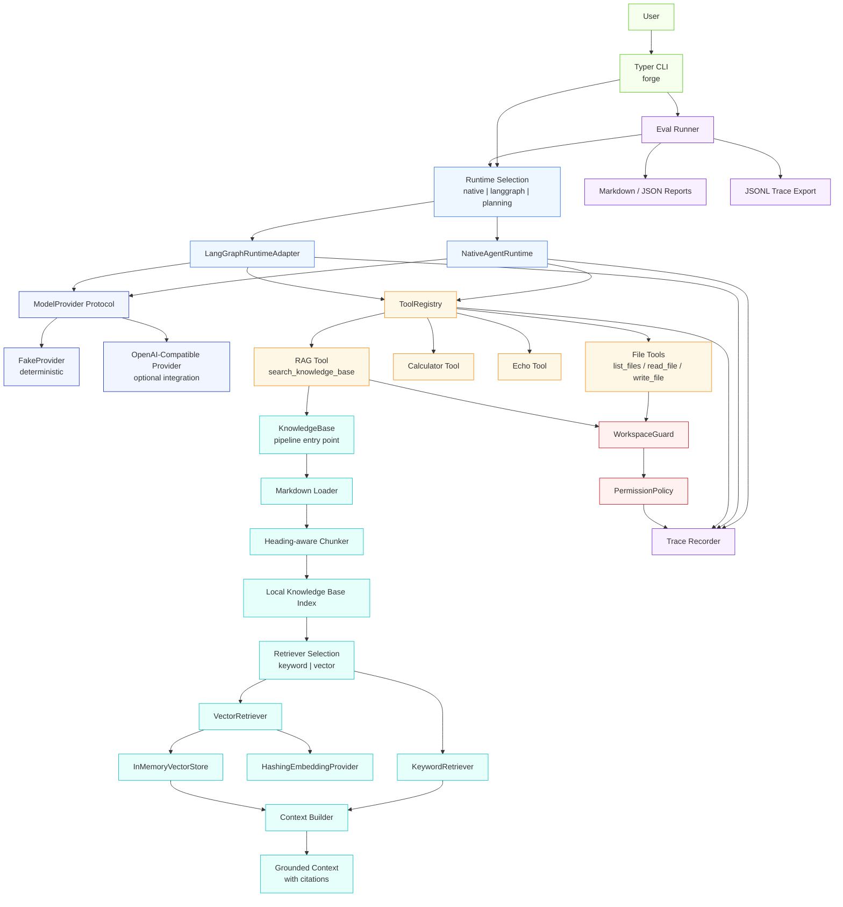
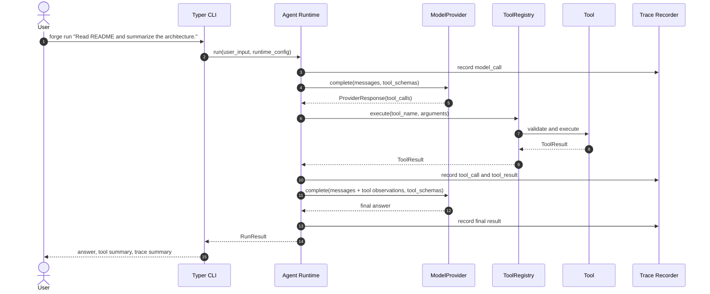
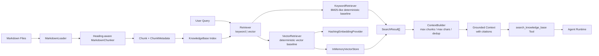

# forge-agent

A minimal, testable Agent Platform runtime built from scratch.

`forge-agent` demonstrates the core engineering capabilities behind production-grade AI agents: runtime orchestration, model provider abstraction, tool calling, local RAG, workspace permission control, structured trace events, deterministic evaluation, and an optional LangGraph runtime adapter.

The project focuses on platform-level abstractions rather than a single LangChain demo. The goal is to make key agent-platform behaviors explicit, reproducible, testable, traceable, and explainable.

This repository is intentionally scoped as a learning and portfolio project. It is not a production SaaS platform, not a full-featured agent framework, and not a replacement for mature frameworks such as LangChain, LangGraph, OpenAI Agents SDK, or other production agent platforms.

---

## Long-term Memory

`forge-agent` supports a scoped long-term memory system that extends static RAG with dynamic, cross-run experience reuse.

Runtime flow:

```text
memory recall -> context compose -> agent run -> memory write
```

The memory system includes:

- `MemoryRecord`, `MemoryType`, and `MemoryScope`
- `MemoryStore` protocol
- deterministic `InMemoryStore`
- persistent `JsonlMemoryStore`
- `MemoryRetriever`
- `MemoryWriter`
- `MemoryWritePolicy`
- `ContextComposer`
- memory recall/write integration in `NativeAgentRuntime`
- memory trace events
- CLI support for memory-enabled runs, listing, and search

Memory-enabled run:

```bash
uv run forge run "记住：我的项目默认使用 Python 3.13 和 uv" \
  --memory-path .memory \
  --session-id demo \
  --max-steps 1
```

Recall memory in a later run:

```bash
uv run forge run "我的项目默认使用什么 Python 版本？" \
  --memory-path .memory \
  --session-id demo \
  --max-steps 1
```

Inspect memory:

```bash
uv run forge memory list --memory-path .memory --session-id demo
uv run forge memory search "Python 3.13" --memory-path .memory --session-id demo
```

Memory is documented in [docs/memory-system.md](docs/memory-system.md).

## Project Overview

`forge-agent` decomposes an AI Agent Platform into clear engineering boundaries:

- Runtime orchestration
- Model provider abstraction
- Tool schema and execution
- Local RAG pipeline
- Selectable retrievers: keyword and vector
- Deterministic hashing embeddings
- In-memory vector store baseline
- Reranker extension boundary
- Workspace permission guard
- Structured trace events
- Deterministic evaluation runner
- Optional LangGraph workflow adapter
- CLI-based demo surface

The project is intentionally compact. The goal is not to maximize features, but to show that core platform behaviors can be run, tested, evaluated, traced, and explained.

---

## Core Capabilities

| Capability | Status | Description |
|---|---:|---|
| Native Agent Runtime | Done | Multi-step agent loop with tool calls, observations, stop reasons, and max-step protection. |
| Runtime Protocol | Done | Allows runtime implementations such as native runtime and LangGraph adapter to share a stable contract. |
| Model Provider Abstraction | Done | Runtime depends on a provider interface instead of a specific model vendor. |
| Deterministic Fake Provider | Done | Enables stable tests and demos without a network dependency. |
| OpenAI-Compatible Provider | Demo-ready | Provides an extension point for real model providers without coupling runtime logic to a vendor. |
| Tool Registry | Done | Registers tools, exposes schemas, validates arguments, and returns structured tool results. |
| File Tools | Done | Supports workspace-scoped file listing, reading, and permission-guarded writing. |
| RAG Tool | Done | Loads local Markdown knowledge bases, chunks documents, retrieves grounded context, and returns citations. |
| Retriever Abstraction | Done | Supports a stable retrieval boundary with keyword and vector retriever implementations. |
| Keyword Retriever | Done | Deterministic BM25-like local retriever used as the default stable baseline. |
| Vector Retriever | Baseline | Deterministic vector retrieval using hashing embeddings and an in-memory vector store. |
| Embedding Provider | Baseline | Deterministic hashing embedding provider for CI-stable vector retrieval tests. |
| Vector Store | Baseline | In-memory vector store with cosine similarity search. |
| Reranker Boundary | Baseline | Identity reranker establishes a future extension point for reranking. |
| Workspace Guard | Done | Blocks path traversal, absolute path escape, and symlink escape outside the workspace. |
| Permission Policy | Done | Allows reads by default and denies writes by default unless explicitly enabled. |
| Trace Events | Done | Records model calls, tool execution, permission decisions, and eval trace output. |
| Eval Runner | Done | Runs JSONL eval cases and writes Markdown/JSON reports and JSONL traces. |
| LangGraph Adapter | Done | Provides an optional workflow runtime while keeping the native runtime abstraction stable. |
| CLI | Done | Provides `run`, `rag index`, `rag search`, and `eval` commands. |
| Tests | Done | Covers runtime, tools, RAG, permission, eval, trace, LangGraph, and CLI paths. |

---

## Architecture Diagram


```mermaid
flowchart TD
    User["User"] --> CLI["Typer CLI<br/>forge"]

    CLI --> RuntimeSelection["Runtime Selection<br/>native | langgraph | planning"]
    RuntimeSelection --> NativeRuntime["NativeAgentRuntime"]
    RuntimeSelection --> LangGraphRuntime["LangGraphRuntimeAdapter"]

    NativeRuntime --> Provider["ModelProvider Protocol"]
    LangGraphRuntime --> Provider
    Provider --> FakeProvider["FakeProvider<br/>deterministic"]
    Provider --> OpenAICompatibleProvider["OpenAI-Compatible Provider<br/>optional integration"]

    NativeRuntime --> ToolRegistry["ToolRegistry"]
    LangGraphRuntime --> ToolRegistry

    ToolRegistry --> FileTools["File Tools<br/>list_files / read_file / write_file"]
    ToolRegistry --> CalculatorTool["Calculator Tool"]
    ToolRegistry --> EchoTool["Echo Tool"]
    ToolRegistry --> RagTool["RAG Tool<br/>search_knowledge_base"]

    FileTools --> WorkspaceGuard["WorkspaceGuard"]
    RagTool --> WorkspaceGuard
    WorkspaceGuard --> PermissionPolicy["PermissionPolicy"]

    RagTool --> KnowledgeBase["KnowledgeBase<br/>pipeline entry point"]
    KnowledgeBase --> Loader["Markdown Loader"]
    Loader --> Chunker["Heading-aware Chunker"]
    Chunker --> Index["Local Knowledge Base Index"]

    Index --> RetrieverSelection["Retriever Selection<br/>keyword | vector"]
    RetrieverSelection --> KeywordRetriever["KeywordRetriever"]
    RetrieverSelection --> VectorRetriever["VectorRetriever"]

    VectorRetriever --> EmbeddingProvider["HashingEmbeddingProvider"]
    VectorRetriever --> VectorStore["InMemoryVectorStore"]

    KeywordRetriever --> ContextBuilder["Context Builder"]
    VectorStore --> ContextBuilder
    ContextBuilder --> Citations["Grounded Context<br/>with citations"]

    NativeRuntime --> TraceRecorder["Trace Recorder"]
    LangGraphRuntime --> TraceRecorder
    ToolRegistry --> TraceRecorder
    PermissionPolicy --> TraceRecorder

    CLI --> EvalRunner["Eval Runner"]
    EvalRunner --> RuntimeSelection
    EvalRunner --> Reports["Markdown / JSON Reports"]
    EvalRunner --> TraceExport["JSONL Trace Export"]

    classDef entry fill:#f6ffed,stroke:#52c41a,stroke-width:1px;
    classDef runtime fill:#eef6ff,stroke:#2f6feb,stroke-width:1px;
    classDef provider fill:#f0f5ff,stroke:#1d39c4,stroke-width:1px;
    classDef tool fill:#fff7e6,stroke:#fa8c16,stroke-width:1px;
    classDef rag fill:#e6fffb,stroke:#13c2c2,stroke-width:1px;
    classDef security fill:#fff1f0,stroke:#cf1322,stroke-width:1px;
    classDef eval fill:#f9f0ff,stroke:#722ed1,stroke-width:1px;

    class User,CLI entry;
    class RuntimeSelection,NativeRuntime,LangGraphRuntime runtime;
    class Provider,FakeProvider,OpenAICompatibleProvider provider;
    class ToolRegistry,FileTools,CalculatorTool,EchoTool,RagTool tool;
    class KnowledgeBase,Loader,Chunker,Index,RetrieverSelection,KeywordRetriever,VectorRetriever,EmbeddingProvider,VectorStore,ContextBuilder,Citations rag;
    class WorkspaceGuard,PermissionPolicy security;
    class TraceRecorder,EvalRunner,Reports,TraceExport eval;
```

---

## Runtime Flow


```mermaid
sequenceDiagram
    autonumber
    actor User
    participant CLI as Typer CLI
    participant Runtime as Agent Runtime
    participant Provider as ModelProvider
    participant Registry as ToolRegistry
    participant Tool as Tool
    participant Trace as Trace Recorder

    User->>CLI: forge run "Read README and summarize the architecture."
    CLI->>Runtime: run(user_input, runtime_config)
    Runtime->>Trace: record model_call
    Runtime->>Provider: complete(messages, tool_schemas)
    Provider-->>Runtime: ProviderResponse(tool_calls)
    Runtime->>Registry: execute(tool_name, arguments)
    Registry->>Tool: validate and execute
    Tool-->>Registry: ToolResult
    Registry-->>Runtime: ToolResult
    Runtime->>Trace: record tool_call and tool_result
    Runtime->>Provider: complete(messages + tool observations, tool_schemas)
    Provider-->>Runtime: final answer
    Runtime->>Trace: record final result
    Runtime-->>CLI: RunResult
    CLI-->>User: answer, tool summary, trace summary
```

The minimal loop is:

```text
model_call -> tool_call -> tool_result -> next model_call -> final_answer
```

The runtime owns orchestration. Providers, tools, permission checks, RAG, and trace export remain independently testable.

---

## RAG Pipeline

`forge-agent` includes a local Markdown-based RAG pipeline. The current RAG implementation is intentionally deterministic and test-friendly.


```mermaid
flowchart LR
    Markdown["Markdown Files"] --> Loader["MarkdownLoader"]
    Loader --> Chunker["Heading-aware MarkdownChunker"]
    Chunker --> Chunks["Chunk + ChunkMetadata"]
    Chunks --> KB["KnowledgeBase Index"]

    Query["User Query"] --> RetrieverChoice["Retriever<br/>keyword | vector"]
    KB --> RetrieverChoice

    RetrieverChoice --> Keyword["KeywordRetriever<br/>BM25-like deterministic baseline"]
    RetrieverChoice --> Vector["VectorRetriever<br/>deterministic vector baseline"]

    Vector --> Embedder["HashingEmbeddingProvider"]
    Vector --> Store["InMemoryVectorStore"]

    Keyword --> Results["SearchResult[]"]
    Store --> Results

    Results --> ContextBuilder["ContextBuilder<br/>max chunks / max chars / dedup"]
    ContextBuilder --> Citations["Grounded Context<br/>with citations"]
    Citations --> RagTool["search_knowledge_base Tool"]
    RagTool --> Runtime["Agent Runtime"]
```

The RAG pipeline does the following:

1. Load Markdown documents from a local knowledge base.
2. Split documents into heading-aware chunks.
3. Preserve source metadata, heading paths, chunk IDs, and ordinals.
4. Retrieve ranked chunks through a selectable retriever.
5. Build bounded grounded context with citations.
6. Expose the search capability as an agent tool.

The key design decision is that the Agent Runtime and RAG tool do not need to know whether retrieval uses keyword search, vector search, or a future hybrid retriever.

### Retriever Options

| Retriever | Status | Purpose |
|---|---:|---|
| `keyword` | Default | Stable deterministic BM25-like retrieval for tests, demos, and regression checks. |
| `vector` | Baseline | Deterministic vector retrieval using hashing embeddings and in-memory cosine similarity search. |

The vector retriever is not intended to be a production semantic search solution. It exists to validate the engineering boundary and make CI-stable vector retrieval tests possible without API keys, network calls, or local model dependencies.

---

## Quick Start

### Requirements

- Python 3.13+
- `uv`

### Install dependencies

```bash
uv sync
```

### Show CLI help

```bash
uv run forge --help
```

Expected commands include:

```text
run   Run one agent task.
eval  Run deterministic agent evals from a JSONL dataset.
rag   RAG commands.
```

---

## Demo 1: Tool Calling

Run a basic tool-calling task:

```bash
uv run forge run "Read README and summarize the architecture."
```

The runtime will:

1. Send the user input to the configured model provider.
2. Receive one or more tool calls.
3. Execute tools through the registry.
4. Feed tool observations back to the provider.
5. Return a final answer with structured runtime metadata.

You can explicitly select the runtime:

```bash
uv run forge run "Read README and summarize the architecture." --runtime native
```

```bash
uv run forge run "Read README and summarize the architecture." --runtime langgraph
```

---

## Demo 2: RAG with Citations

Index the local knowledge base:

```bash
uv run forge rag index examples/knowledge_base
```

Search the same knowledge base with the default keyword retriever:

```bash
uv run forge rag search "workspace guard permission" \
  --knowledge-base examples/knowledge_base \
  --retriever keyword \
  --top-k 3
```

Search the same knowledge base with the deterministic vector retriever:

```bash
uv run forge rag search "workspace guard permission" \
  --knowledge-base examples/knowledge_base \
  --retriever vector \
  --top-k 3
```

Ask a question grounded in the knowledge base through the Agent Runtime:

```bash
uv run forge run "根据知识库回答：workspace guard permission 相关内容是什么？" \
  --knowledge-base examples/knowledge_base
```

The RAG path demonstrates:

- local Markdown loading
- heading-aware chunking
- metadata-preserving chunks
- selectable retrievers
- deterministic keyword retrieval
- deterministic vector retrieval baseline
- grounded context building
- source citation output
- runtime integration through `search_knowledge_base`

---

## Demo 3: Eval and Trace

Run the deterministic eval dataset:

```bash
uv run forge eval examples/evals/agent_platform.jsonl
```

The eval runner checks whether each case satisfies expected behavior such as:

- expected tool usage
- expected answer content
- expected source citations
- expected stop reason
- case-level success or failure

Depending on CLI options and defaults, eval execution can produce:

- Markdown report
- JSON report
- JSONL trace file

The trace file is useful for understanding model calls, tool execution, permission decisions, and failure modes.

---

## Final Verification

The expected local quality gate is:

```bash
uv run ruff format --check .
uv run ruff check .
uv run mypy src tests
uv run pytest -v
```

RAG CLI verification:

```bash
uv run forge rag search "workspace guard permission" \
  --knowledge-base examples/knowledge_base \
  --retriever keyword \
  --top-k 3
```

```bash
uv run forge rag search "workspace guard permission" \
  --knowledge-base examples/knowledge_base \
  --retriever vector \
  --top-k 3
```

Full Agent Runtime + RAG tool verification:

```bash
uv run forge run "根据知识库回答：workspace guard permission 相关内容是什么？" \
  --knowledge-base examples/knowledge_base
```

Current verified baseline:

```text
pytest: 159 passed
mypy: no issues found
ruff check: all checks passed
ruff format: all files formatted
keyword RAG search: passed
vector RAG search: passed
Agent Runtime + RAG tool: passed
```

Optional repository checks:

```bash
git status --short
git log --oneline --decorate -n 15
```

---

## Project Structure

```text
forge-agent/
├── docs/
│   └── rag-architecture.md
├── examples/
│   ├── evals/
│   │   └── agent_platform.jsonl
│   └── knowledge_base/
│       └── *.md
├── src/
│   └── forge_agent/
│       ├── cli/
│       │   └── app.py
│       ├── evals/
│       │   ├── dataset.py
│       │   ├── metrics.py
│       │   ├── report.py
│       │   └── runner.py
│       ├── integrations/
│       │   └── langgraph/
│       │       └── workflows.py
│       ├── observability/
│       │   ├── events.py
│       │   ├── exporter.py
│       │   └── trace.py
│       ├── providers/
│       │   ├── base.py
│       │   ├── fake.py
│       │   └── openai_compatible.py
│       ├── rag/
│       │   ├── embeddings/
│       │   │   ├── base.py
│       │   │   └── hashing.py
│       │   ├── rerankers/
│       │   │   ├── base.py
│       │   │   └── identity.py
│       │   ├── retrievers/
│       │   │   ├── base.py
│       │   │   ├── keyword.py
│       │   │   └── vector.py
│       │   ├── stores/
│       │   │   ├── base.py
│       │   │   └── memory.py
│       │   ├── chunker.py
│       │   ├── citation.py
│       │   ├── context_builder.py
│       │   ├── document.py
│       │   ├── knowledge_base.py
│       │   ├── loader.py
│       │   └── retriever.py
│       ├── runtime/
│       │   ├── native_runtime.py
│       │   ├── protocol.py
│       │   └── state.py
│       ├── security/
│       │   ├── errors.py
│       │   ├── permission.py
│       │   └── workspace.py
│       └── tools/
│           ├── base.py
│           ├── calculator.py
│           ├── defaults.py
│           ├── echo.py
│           ├── file_tools.py
│           ├── rag_tool.py
│           └── registry.py
├── tests/
│   ├── test_cli_eval.py
│   ├── test_cli_rag.py
│   ├── test_cli_run.py
│   ├── test_eval_*.py
│   ├── test_file_tools_permission.py
│   ├── test_langgraph_trace.py
│   ├── test_permission_*.py
│   ├── test_rag_*.py
│   ├── test_runtime_*.py
│   ├── test_tool_registry.py
│   ├── test_trace_exporter.py
│   └── test_workspace_guard.py
├── pyproject.toml
├── README.md
└── LICENSE
```

---

## Design Decisions

### 1. Native runtime first

The project starts with a self-owned runtime instead of delegating all behavior to a framework.

The core loop is explicit:

```text
input -> model call -> tool call -> tool result -> next model call -> final answer
```

Benefits:

- easier to test
- easier to explain in interviews
- clear ownership of stop conditions and error handling
- framework-independent runtime contract

### 2. LangGraph as an adapter

LangGraph is integrated as an optional runtime adapter, not as the only runtime.

This keeps the platform boundary stable:

```text
CLI -> Runtime Protocol -> Native Runtime or LangGraph Adapter
```

Benefits:

- preserves the native runtime as the reference implementation
- allows workflow orchestration to be swapped or extended
- avoids coupling all business logic to LangGraph-specific APIs

### 3. Deterministic provider for tests

`FakeProvider` is used to make runtime behavior deterministic.

Benefits:

- no external API key required
- no network dependency in tests
- stable CI behavior
- repeatable tool-calling and eval scenarios

### 4. RAG as a tool

RAG is exposed as a platform tool instead of being hardcoded into the runtime.

Benefits:

- the runtime stays generic
- RAG can be permission-checked and traced like other tools
- retrieval logic can be tested independently
- the retriever can evolve without changing the Agent Runtime

### 5. RAG pipeline boundaries

The RAG pipeline separates these responsibilities:

```text
MarkdownLoader       -> load source documents
MarkdownChunker      -> create retrievable chunks
ChunkMetadata        -> preserve source and citation data
Retriever            -> retrieve ranked chunks
EmbeddingProvider    -> convert text to vectors
VectorStore          -> store and search vectors
Reranker             -> reorder first-stage results
ContextBuilder       -> build bounded grounded context
Citation             -> trace answers back to sources
KnowledgeBase        -> compose the local RAG pipeline
```

This separation allows future additions such as hybrid retrieval, real embedding models, vector databases, and rerankers without rewriting the Agent Runtime.

### 6. Deterministic vector retrieval baseline

`HashingEmbeddingProvider` and `InMemoryVectorStore` are intentionally simple.

They are used to validate the vector retrieval boundary while keeping tests stable:

- no API key required
- no model download required
- no network dependency
- deterministic CI behavior
- easy to replace with real embeddings or vector databases later

### 7. Permission before file access

Workspace safety is enforced before file tools and RAG index paths access local files.

The guard blocks:

- `../` path traversal
- absolute path escape
- symlink escape outside the workspace

The permission policy denies writes by default.

### 8. Trace and eval as first-class concerns

Trace events and eval reports are part of the platform demo, not afterthoughts.

The project records key events such as:

- model call
- model response
- tool call
- tool result
- permission decision
- final answer
- eval case result

This makes behavior easier to debug, evaluate, and explain.

---

## Testing

The test suite covers the core platform matrix.

### Runtime Tests

- provider returns tool calls
- runtime executes tool calls
- runtime stops when completed
- runtime stops at max steps
- runtime handles tool errors
- native and LangGraph runtimes return the same result shape

### Tool Tests

- registry registers tools
- duplicate tool names are rejected
- unknown tools return structured errors
- argument validation errors are structured
- file tools use workspace guard

### RAG Tests

- Markdown loader loads documents
- chunker preserves source metadata
- chunker preserves heading paths
- keyword retriever returns relevant chunks
- hashing embedding is deterministic
- in-memory vector store returns stable similarity results
- vector retriever returns deterministic ranked chunks
- identity reranker preserves order
- KnowledgeBase can select keyword or vector retriever
- ContextBuilder includes citations
- RAG tool returns grounded results

### Permission Tests

- read inside workspace is allowed
- read outside workspace is denied
- write requires permission
- path traversal is blocked
- permission denial is recorded in trace

### Eval and Trace Tests

- eval runner loads JSONL
- expected tool usage is checked
- expected answer content is checked
- expected source citations are checked
- trace records model and tool events
- trace exporter writes JSONL

### CLI Tests

- CLI help works
- run command works
- RAG index command works
- RAG keyword search command works
- RAG vector search command works
- eval command works
- runtime selection works

Run all checks:

```bash
uv run ruff format --check .
uv run ruff check .
uv run mypy src tests
uv run pytest -v
```

---

## Documentation

Additional design notes are available under `docs/`.

Important documents include:

- `docs/rag-architecture.md`

The RAG architecture document explains:

- current local RAG baseline
- Retriever / EmbeddingProvider / VectorStore / Reranker boundaries
- keyword retrieval and vector retrieval responsibilities
- deterministic vector retrieval positioning
- future hybrid retrieval and rerank extension points
- evaluation implications

---

## Limitations

`forge-agent` is a demo-level Agent Platform, not a production SaaS system.

Current limitations:

- no production-grade sandbox
- no distributed execution
- no persistent multi-turn session store
- no multi-tenant isolation
- no production secret management
- no distributed tracing backend
- no OpenTelemetry integration
- no persistent vector database
- no production semantic embedding model
- no hybrid retrieval yet
- no production reranker yet
- no online evaluation service
- no human approval workflow
- no web UI
- no deployment manifests
- no production CI/CD pipeline included in the demo scope
- no cost tracking or budget enforcement
- no multi-agent orchestration

These are intentionally left out to keep the project focused on core platform abstractions.

---

## Roadmap

Potential future improvements:

### Runtime

- persistent sessions
- streaming output
- interrupt and resume
- richer stop reasons
- human-in-the-loop approval points

### Tooling and Security

- stronger sandbox isolation
- audited write approval flow
- command execution with allowlist policy
- secret redaction
- policy-driven tool permissions

### RAG

- OpenAI-compatible embedding provider
- local embedding model provider
- persistent vector database backend
- hybrid retrieval
- score normalization and result merging
- reranking
- citation quality scoring
- retrieval quality evaluation
- document freshness metadata

### Observability

- OpenTelemetry integration
- trace viewer
- structured logs
- latency metrics
- token and cost metrics

### Evaluation

- larger eval datasets
- retrieval-specific eval suite
- regression eval suite
- online eval dashboard
- failure clustering
- quality gates for CI

### Packaging and Deployment

- GitHub Actions CI
- Docker image
- release artifacts
- example deployment profile

---

## Interview Talking Points

### 30-second version

I built `forge-agent`, a minimal Agent Platform demo.

The focus is not a single agent application, but the platform capabilities behind agents: runtime orchestration, tool calling, local RAG, selectable retrieval, permission control, trace events, eval runner, and a LangGraph adapter. It has CLI demos, tests, and eval cases to prove the key paths are reproducible and verifiable.

### 2-minute version

`forge-agent` is a minimal Agent Platform demo. At the bottom, I implemented a native Agent Runtime to demonstrate multi-step agent loops, tool calls, stop conditions, and error feedback.

The model layer is abstracted through a `ModelProvider` protocol, so the runtime is not coupled to one vendor. The tool layer uses a `ToolRegistry` and structured schemas. RAG is implemented as a platform tool with local Markdown loading, heading-aware chunking, selectable retrievers, deterministic keyword retrieval, vector retrieval baseline, context building, and citations.

For safety, it has a workspace guard and permission policy to block path traversal and unauthorized writes. For quality and observability, it includes trace events, JSONL trace export, and a deterministic eval runner.

Finally, it integrates LangGraph as an optional runtime adapter, showing how workflow orchestration can be added without replacing the platform boundary.

### RAG architecture version

I upgraded the original keyword-only RAG demo into a composable RAG pipeline.

The key change is separating `Retriever`, `EmbeddingProvider`, `VectorStore`, `Reranker`, `ContextBuilder`, and `Citation` boundaries. Keyword retrieval remains the default deterministic baseline, while vector retrieval is implemented with deterministic hashing embeddings and an in-memory vector store. This keeps tests stable and makes the vector retrieval path verifiable without network calls or API keys.

The Agent Runtime and RAG tool do not know whether the underlying retrieval strategy is keyword or vector. This means future hybrid retrieval, real embedding models, vector databases, or rerankers can be added without rewriting the runtime.

### Production-level gap

This is a demo-level platform rather than a production SaaS system.

A production version would need multi-tenant isolation, persistent sessions, distributed tracing, stronger sandboxing, secret management, audit logs, cost controls, production-grade embedding models, persistent vector databases, hybrid retrieval, reranking, approval workflows, online evaluation, and CI/CD.

The value of this demo is that the core abstractions and critical paths are implemented, tested, and explainable.

---

## License

This project is licensed under the Apache License 2.0. See [LICENSE](LICENSE) for details.

## RAG Quality Evaluation

`forge-agent` includes a deterministic RAG quality loop for comparing keyword, vector, hybrid retrieval, and reranking behavior.

It supports:

- selectable retrievers: `keyword`, `vector`, `hybrid`;
- Reciprocal Rank Fusion for hybrid retrieval;
- deterministic `keyword-overlap` reranking;
- JSONL retrieval eval datasets;
- metrics such as `source_hit_rate`, `recall_at_k`, `MRR`, `term_hit_rate`, `no_answer_accuracy`, and `citation_presence_rate`;
- Markdown and JSON eval reports.

Example:

    uv run forge rag eval examples/evals/rag_retrieval.jsonl \
      --knowledge-base examples/knowledge_base \
      --retriever hybrid \
      --reranker keyword-overlap \
      --top-k 5 \
      --top-n 3 \
      --output examples/reports/rag-eval-report.md \
      --json-output examples/reports/rag-eval-results.json

See [`docs/rag-quality.md`](docs/rag-quality.md) for the retrieval evaluation design and report interpretation.

Generated example reports:

- [`examples/reports/rag-eval-report.md`](examples/reports/rag-eval-report.md)
- [`examples/reports/rag-eval-results.json`](examples/reports/rag-eval-results.json)

## Planning Runtime

`forge-agent` includes a traceable Plan-Execute-Replan runtime that makes task planning explicit, deterministic, testable, and observable.

The native runtime follows a compact multi-step loop:

```text
model_call -> tool_call -> tool_result -> final_answer
```

The planning runtime adds an explicit planning lifecycle:

```text
create_plan -> execute_step -> observe -> replan_if_needed -> final_answer
```

### What it demonstrates

- explicit `Plan` and `PlanStep` lifecycle modeling
- deterministic task decomposition through `SimplePlanner`
- structured recovery decisions through `ReplanPolicy`
- planning-aware model/tool execution through `PlanningRuntime`
- planning trace events such as `plan_created`, `plan_step_started`, `plan_step_failed`, `replan_triggered`, and `plan_completed`
- planning-specific stopped reasons such as `planning_failed` and `replan_limit_reached`

### CLI usage

Run the planning runtime:

```bash
uv run forge run "总结知识库内容，然后给出结论" --runtime planning
```

Validate structured stop behavior:

```bash
uv run forge run "echo hello" --runtime planning --max-steps 0
```

See [Planning Runtime Architecture](docs/planning-architecture.md) for the detailed design.

## Reflection / Verification Runtime

`forge-agent` includes a Reflection Runtime that verifies an agent answer before
returning it to the caller.

The reflection flow is:

    final_answer -> verify -> accept / revise / retry / abort

Key components:

- `VerificationResult`: structured verification result with decision, reasons,
  missing evidence, unsupported claims, and confidence.
- `RuleVerifier`: deterministic runtime verifier for empty answers, failed tool
  executions, permission failures, abnormal outputs, and max-step termination.
- `RagVerifier`: citation-groundedness verifier for RAG answers.
- `ReflectionRuntime`: wrapper runtime that composes with an existing runtime and
  adds a verification gate.
- Reflection trace events: `reflection_started`, `verification_result`,
  `critique_generated`, `revision_requested`, `reflection_completed`, and
  `reflection_failed`.

Run with reflection enabled:

    uv run forge run "echo hello" --runtime reflection

Run evals with reflection reporting:

    uv run forge eval examples/evals/reflection_runtime_eval.jsonl \
      --runtime reflection \
      --output examples/reports/reflection-report.md \
      --trace-out examples/reports/reflection-traces.jsonl

See `docs/reflection-architecture.md` for the detailed design.
