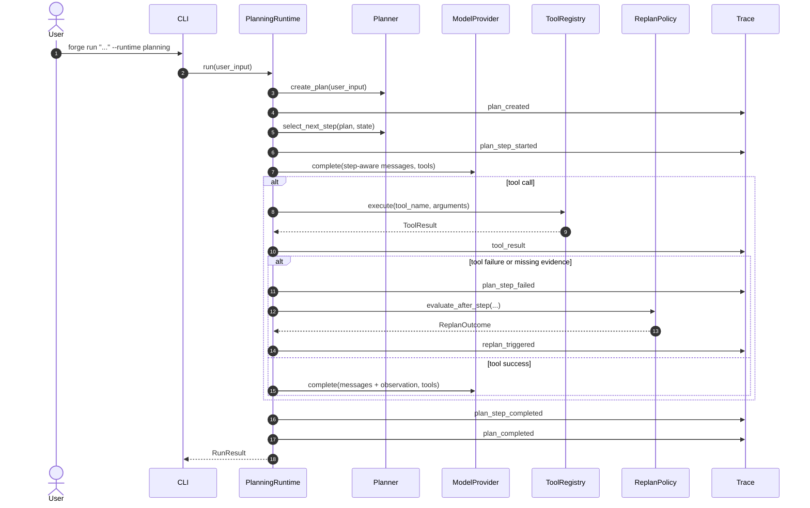

# Planning Runtime Architecture

`forge-agent` includes a traceable Plan-Execute-Replan runtime.

The goal is not to build a full AutoGPT-style autonomous agent. The goal is to make task planning explicit, deterministic, testable, and observable inside the agent platform.

## Problem

The native runtime follows a compact multi-step loop:

```text
model_call -> tool_call -> tool_result -> final_answer
```

That loop is simple and flexible, but the global task plan is implicit. For complex tasks, this makes behavior harder to inspect, test, debug, and explain.

The Planning Runtime adds an explicit planning layer:

```text
create_plan -> execute_step -> observe -> replan_if_needed -> final_answer
```

## Core Components

| Component | Responsibility |
|---|---|
| `Plan` | Represents the full task plan for one user request. |
| `PlanStep` | Represents one executable unit inside the plan. |
| `StepStatus` | Tracks step lifecycle: `pending`, `running`, `succeeded`, `failed`, `skipped`. |
| `PlanStatus` | Tracks full-plan lifecycle. |
| `Planner` | Defines the planning interface. |
| `SimplePlanner` | Deterministic rule-based planner for tests and local demos. |
| `ReplanPolicy` | Decides whether to continue, replan, or stop after an observation. |
| `PlanningRuntime` | Coordinates planner, provider, tool registry, step execution, replanning, and trace events. |

## Runtime Flow



## Planner Boundary

The planner decides **what should be done**.

It does not execute tools, call the model provider, enforce permissions, or write trace events.

Current `SimplePlanner` behavior:

| Input shape | Generated plan |
|---|---|
| Plain task | One `answer` step. |
| Compound task with `then`, `and`, `然后`, or `并且` | Multiple ordered steps. |
| RAG-like task | `retrieve_context -> answer_with_context`. |
| File/workspace-like task | `inspect_workspace -> execute_operation -> summarize_result`. |

## Replan Policy

`ReplanPolicy` converts observations into deterministic planning decisions.

Current triggers:

| Trigger | Decision |
|---|---|
| Tool failure | Replan with a recovery step. |
| Permission denied | Replan to a safe explanation step; do not retry the denied action. |
| Evidence required but empty retrieval | Replan to a bounded answer without evidence. |
| Replan count reaches max limit | Stop with `replan_limit_reached`. |

## Trace Events

Planning-specific trace events:

```text
plan_created
plan_step_started
plan_step_completed
plan_step_failed
replan_triggered
plan_completed
```

These events make the planning lifecycle auditable and testable.

## Stop Reasons

Planning Runtime supports the shared runtime stop reasons:

```text
completed
max_steps
error
```

It also supports planning-specific stop reasons:

```text
planning_failed
replan_limit_reached
```

## CLI Usage

Run the planning runtime:

```bash
uv run forge run "总结知识库内容，然后给出结论" --runtime planning
```

Limit model steps to validate structured stop behavior:

```bash
uv run forge run "echo hello" --runtime planning --max-steps 0
```

## Limitations

- The current planner is rule-based and deterministic.
- It is intended for stable tests and local demos, not advanced autonomous planning.
- The current runtime executes one plan at a time.
- Replacement steps are simple recovery steps, not LLM-generated plans.
- Long-horizon memory, human approval checkpoints, and persistent plan storage are future extensions.

## Why This Matters

This runtime demonstrates that `forge-agent` can support:

- explicit task decomposition
- traceable step execution
- structured failure handling
- deterministic replanning
- runtime-level observability
- framework-independent planning abstractions
